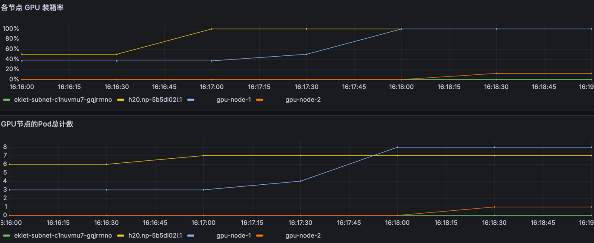
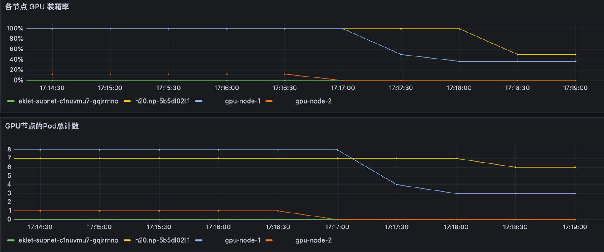

# 按GPU装箱率扩缩容演示demo

## 方案说明
Kubernetes 默认调度器（如kube-scheduler）的核心目标是保障Pod调度成功，但缺乏对GPU资源利用率的细粒度优化。

在实际应用中，GPU资源成本高昂且常成为瓶颈。如果能依据集群内GPU的实时装箱率（即GPU使用密集程度）进行应用的智能扩缩容，将能显著提升GPU资源利用率，降低基础设施成本，并在资源紧张时更有效地容纳更多工作负载。

本方案旨在验证使用TKE的智能调度能力，可以提升GPU资源的使用率。即，扩容时，pod可以优先调度到GPU装箱率较高的节点上；缩容时，GPU低装箱率节点上的pod会优先被销毁；

## 原理说明
本功能的核心依赖于 PlacementPolicy 调度策略。PlacementPolicy 是 TKE (Tencent Kubernetes Engine) 提供的增强调度功能，它允许用户根据业务需求自定义资源的优先级权重规则（例如本Demo中将GPU装箱率设置为优先级因子）。
- 扩缩容智能调度： 
  - 扩容时，PlacementPolicy 会优先选择高优先级的节点（在此场景中，高GPU装箱率被视为高优先级）。这将引导新Pod尽可能复用已高负载节点上的空闲容量碎片，提高集群整体GPU装箱率。 
  - 缩容时，PlacementPolicy 会优先驱逐低优先级资源节点上的Pod（在此场景中，低GPU装箱率节点被视为低优先级）。这将促使在资源利用率较低的节点上优先释放，便于后续工作负载整合或节点回收。
- 参考文档 https://cloud.tencent.com/document/product/457/118259

## 使用说明
**前置依赖**
- 拥有一个 TKE 集群，并已登录到集群中

**操作说明**
1. 准备环境： 
- 安装 Crane-Scheduler v1.6.4
- 创建GPU节点 
- 下发PlacementPolicy策略规则 
- 确认初始各节点GPU分配状态与装箱率
```bash
bash step1-prepare-gpu-allocate-pp-demo.sh
```

2. 执行扩容测试：
- 逐步增加工作负载副本数
- 观察验证，确认新Pod被调度到了当前GPU装箱率最高的节点上
```bash
bash step2-scaleup-and-check-schedule-result.sh
```
3. 执行缩容测试：
- 逐步减少工作负载副本数 
- 观察验证，确认被终止的Pod优先发生在当前GPU装箱率最低的节点上，证明TKE智能调度策略可以整合资源，释放低效节点
```bash
bash step3-scaledown-and-check-schedule-result.sh
```

## 效果展示
1) 工作负载扩容时，优先把Pod调度到高GPU装箱率的节点上

2) 工作负载缩容时，优先缩容低GPU装箱率的节点上的Pod

