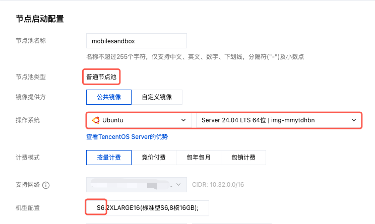
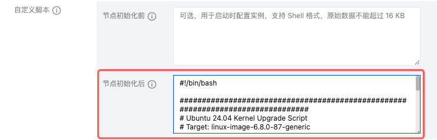
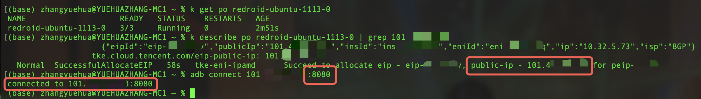
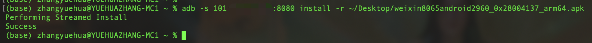
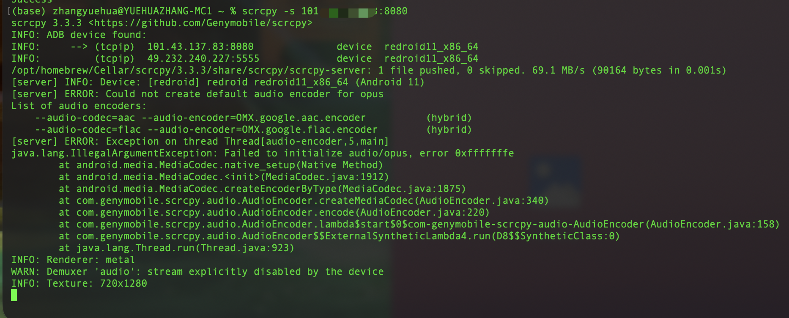
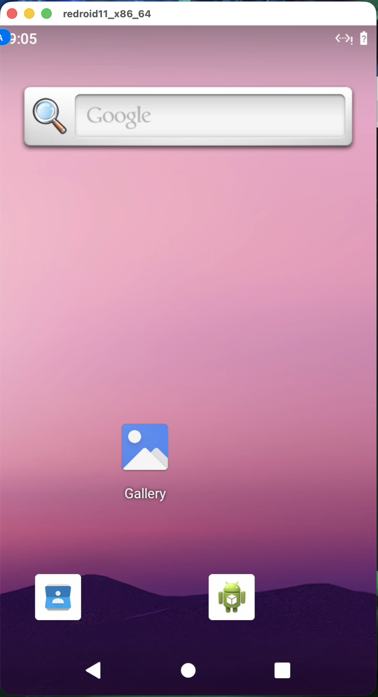
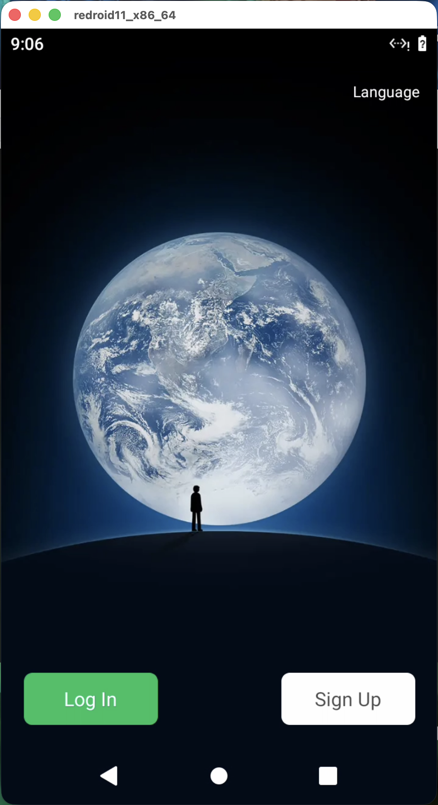
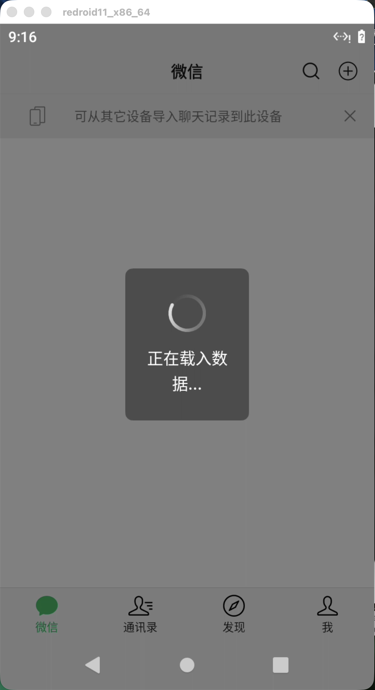
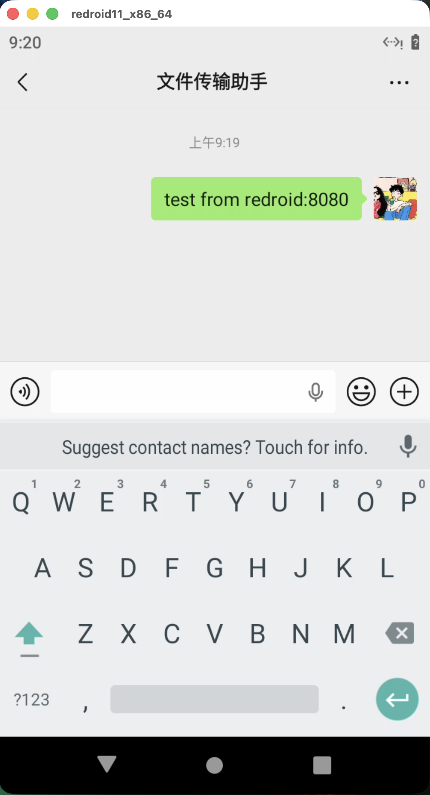
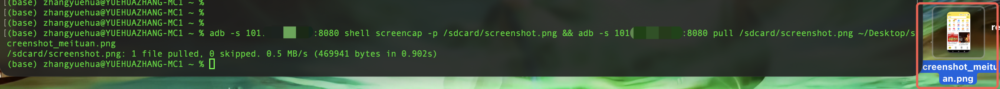

# mobile-sandbox

Deploy Android containers on Tencent Kubernetes Engine (TKE) for mobile app testing and automation.

## Quick Start

### Prerequisites

- TKE cluster v1.28+
- Node pool configuration:
  - Machine: **S6 series**
  - OS: **Ubuntu Server 24.04 LTS 64-bit** (`img-mmytdhbn`)
  - Kernel: **6.8.0-87** (upgraded via init script)

### Installation

**1. Create Node Pool**

Select S6 series with Ubuntu 24.04:



Add kernel upgrade script in "Post Node Init":



The script `upgrade_kernel_to_6.8.0-87.sh` is included in this project.

**2. Deploy Chart**

Modify values to specify node pool ID.
```bash
helm install mobile-sandbox ./helm-charts/mobile-sandbox
```

**3. Verify Deployment**

```bash
kubectl get pods -l k8s-app=redroid
kubectl get daemonset -l app=redroid-ubuntu-module-loader
```

## Usage

### Connect via ADB

**Direct (via EIP):**
```bash
# Get EIP
kubectl get pod <pod-name> -o jsonpath='{.metadata.annotations.tke\.cloud\.tencent\.com/eip-public-ip}'

# Connect device
adb connect <EIP>:5555
```

### Example: WeChat Testing

**1. Connect to device**

```bash
adb connect <POD_IP>:5555
```



**2. Install APK**

```bash
adb push weixin.apk /sdcard/
adb install /sdcard/weixin.apk
```



**3. Open UI**

```bash
scrcpy -s <DEVICE_ID>
```





**4. Launch WeChat**



**5. Test Features**

Login:



Send messages:



Mini-programs:


Screenshots:



## Configuration

### Key Parameters

| Parameter | Description | Default |
|-----------|-------------|---------|
| `redroid.replicas` | Number of Android instances | `1` |
| `redroid.nodeAffinity.nodepoolIds` | Node pool IDs for scheduling | `[np-xxxxxxxx]` |
| `redroid.container.resources.requests.cpu` | CPU per instance | `6500m` |
| `redroid.container.resources.requests.memory` | Memory per instance | `10Gi` |
| `moduleLoader.nodeAffinity.nodepoolIds` | Node pools for module loader | `[np-xxxxxxxx]` |

### Android Settings

```yaml
redroid:
  container:
    args:
      - androidboot.redroid_width=1080      # Screen width
      - androidboot.redroid_height=1920     # Screen height
      - androidboot.redroid_dpi=480         # Screen DPI
      - androidboot.redroid_fps=30          # Frame rate
```
More parameters: https://github.com/ERSTT/redroid

### Network Configuration

Each pod is auto-configured with:
- **EIP**: Public IP with 100Mbps bandwidth
- **ENI**: TKE route-eni mode
- **Route Guardian**: Sidecar maintains routing tables

## Architecture

```
┌─────────────────────────────────────────┐
│  Module Loader DaemonSet                │
│  • Loads binder_linux, ashmem_linux     │
│  • Loads iptables modules               │
└─────────────────────────────────────────┘

┌─────────────────────────────────────────┐
│  Redroid StatefulSet                    │
│  ┌─────────────────────────────────┐   │
│  │ Pod                             │   │
│  │ ├─ redroid (Android 11)         │   │
│  │ ├─ route-setup (Network)        │   │
│  │ └─ logcat-sidecar (Logs)        │   │
│  └─────────────────────────────────┘   │
└─────────────────────────────────────────┘
```

### Components

- **redroid**: Android 11 with Houdini ARM translation
- **route-setup**: Maintains routing for TKE ENI
- **logcat-sidecar**: Collects Android logs via ADB
- **module-loader**: Loads kernel modules on each node

## Troubleshooting

### Pod Not Starting

```bash
# Check module loader
kubectl logs -l app=redroid-ubuntu-module-loader

# Verify kernel modules
kubectl exec -it <module-loader-pod> -- lsmod | grep -E "binder|ashmem"
```

### ADB Connection Failed

```bash
# Check Redroid status
kubectl logs <pod-name> -c redroid

# Verify ADB port
kubectl exec -it <pod-name> -c redroid -- netstat -tlnp | grep 5555
```

### Network Issues

```bash
# Check route configuration
kubectl logs <pod-name> -c route-setup

# Test connectivity
kubectl exec -it <pod-name> -c redroid -- ping -c 3 8.8.8.8
```

## Uninstall

```bash
helm uninstall mobile-sandbox
```

**Note**: EIPs are retained by default. Delete manually from TKE console if needed.

## References

- [Redroid Documentation](https://github.com/ERSTT/redroid)
- [TKE Documentation](https://cloud.tencent.com/document/product/457)
- [Create TKE Cluster](https://cloud.tencent.com/document/product/457/103981)
